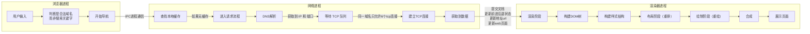

```mermaid
flowchart LR
  subgraph 浏览器进程
    A[用户输入] --> B[处理输入信息]
    B[判断是合法域名<br>而非搜索关键字] --> C[开始导航]
  end
  subgraph 网络进程
    direction TB
    C[开始导航] -->|IPC进程通信| D[查找本地缓存]
    D -->|如果无缓存| E[进入请求流程]
    E --> F[DNS解析]
    F --> |获取到 IP 和 端口 | G[等待 TCP 队列]
    G --> |同一域名只允许6个tcp连接| H[建立TCP连接]
    H --> I[获取到数据]
  end
  subgraph 渲染器进程
    I --> |提交文档<br>更新前进后退状态<br>更新地址url<br>更新web页面| J[渲染阶段]
    J --> K[构建DOM树]
    K --> L[构建样式结构]
    L --> M[布局阶段（重排）]
    M --> N[绘制阶段（重绘）]
    N --> O[合成]
    O --> P[展示页面]
  end
```
